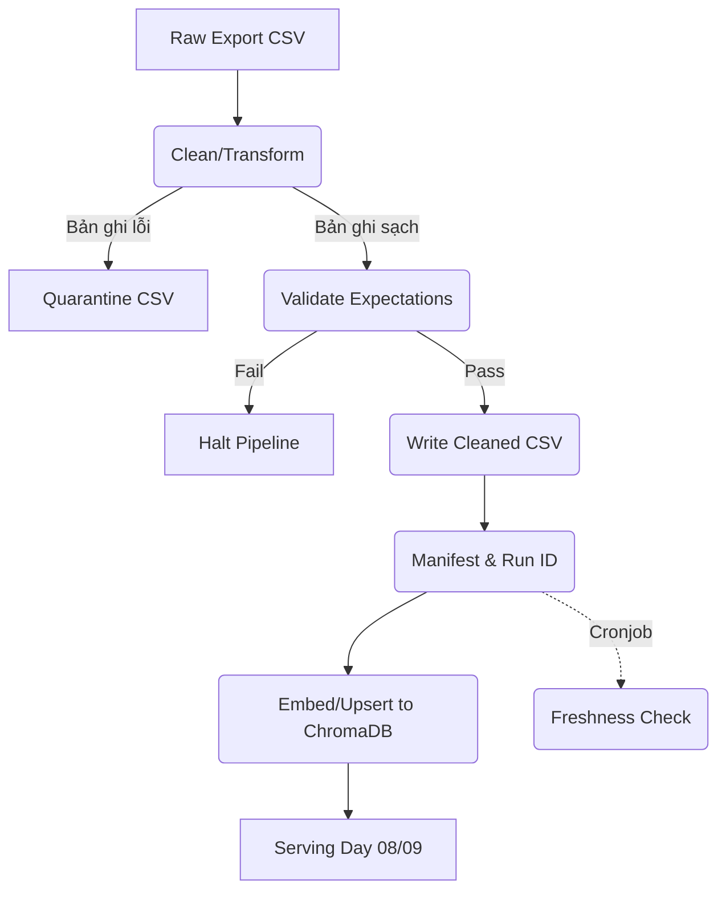

# Kiến trúc pipeline — Lab Day 10

**Nhóm:** AI Action Team  
**Cập nhật:** 2026-06-10

---

## 1. Sơ đồ luồng (bắt buộc có 1 diagram: Mermaid / ASCII)

---

## 2. Ranh giới trách nhiệm

| Thành phần | Input | Output | Owner nhóm |
|------------|-------|--------|--------------|
| Ingest | Raw Data (CSV) | Raw Records Dict | Nguyễn Văn A |
| Transform | Raw Records Dict | Cleaned Records & Quarantine CSV | Trần Văn B |
| Quality | Cleaned Records | Expectation Results (Halt/Pass) | Trần Văn B |
| Embed | Cleaned CSV | ChromaDB Collections | Lê Thị C |
| Monitor | Manifest JSON | Alerts (PASS/WARN/FAIL) | Phạm Văn D |

---

## 3. Idempotency & rerun

> Mô tả: upsert theo `chunk_id` hay strategy khác? Rerun 2 lần có duplicate vector không?
Idempotency được đảm bảo qua `chunk_id`. ID này sinh ra bởi hàm băm (hash SHA-256) dựa trên nội dung text, doc_id và số sequence. Khi embed, hệ thống dùng phương thức `upsert` của ChromaDB theo `chunk_id`. Nếu chạy lại pipeline 2 lần, ChromaDB chỉ update lại bản ghi trùng ID thay vì tạo mới (không duplicate). Những ID cũ không còn nằm trong tập Cleaned sẽ bị `prune` (xoá) khỏi DB.

---

## 4. Liên hệ Day 09

> Pipeline này cung cấp / làm mới corpus cho retrieval trong `day09/lab` như thế nào? (cùng `data/docs/` hay export riêng?)
Pipeline này tạo Vector DB tại thư mục `artifacts/chroma_db` hoặc `db/` và gán cho `day10_kb` collection. Tầng Agent (Day 09) sẽ trỏ kết nối vào đúng collection này thay vì đọc trực tiếp txt để đảm bảo dữ liệu luôn được dọn dẹp và validate trước khi Agent tìm kiếm, tránh việc Model hallucinate dựa trên text lỗi/cũ.

---

## 5. Rủi ro đã biết

- Pipeline hiện chỉ xử lý qua CSV, nếu có thay đổi cấu trúc bảng từ nguồn thì hàm đọc CSV sẽ bị break.
- Chưa có module validate Data Type bằng Pydantic, chỉ dùng hàm regex tự viết.
